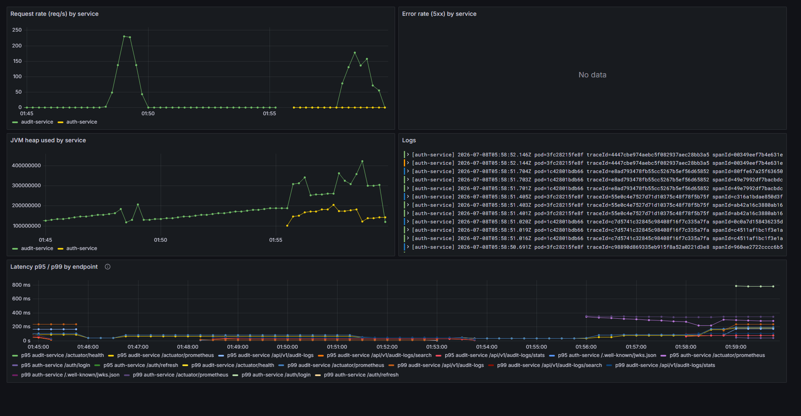

# AI-Sandbox Backend

A Spring Boot 3.5 / Java 17 multi-module microservice backend, built with Gradle and deployed
live at https://ai-sandbox.sahilparekh1212.com (GCE VM, deployed from GitHub Actions; OpenShift
manifests also provided). Each service is an independently buildable, runnable and
scalable Gradle subproject.

## Services

| Service        | Port | Module         | Purpose                                              |
|----------------|------|----------------|------------------------------------------------------|
| Auth           | 8085 | `Auth`         | Google OAuth2 login, issues/refreshes JWTs, JWKS     |
| Audit          | 8083 | `Audit`        | Audit-log create/read/delete (immutable)             |

A third Gradle subproject, `common`, is a plain shared library (no `main`, not independently
runnable) holding code identical across both services: the `AuditEvent` Kafka message contract
and the `ratelimit/` package described below.

All services share: JWT resource-server security, Swagger/OpenAPI docs, structured
logging, a global exception handler, an actuator health endpoint, and the rate
limiter described below.

Non-obvious design tradeoffs (why RSA over HMAC, why the refresh-token store moved to Redis to make
Auth stateless — and why the rate limiter stays per-pod, why H2 in tests, why Liquibase owns the
schema) are written up in [`docs/adr/`](docs/adr/README.md).

### LLM chat assistant

The Audit service also hosts `POST /api/v1/assistant/chat` — a server-side proxy that lets the
SPA's Assistant page ask a Claude model questions about the application, grounded on an app
overview doc plus live audit data. Enable it by exporting `ANTHROPIC_API_KEY` before starting
the Audit service (or `docker compose up`); without a key the endpoint returns 503 and nothing
else is affected. Model and output size are tunable via `ASSISTANT_MODEL` (default
`claude-opus-4-8`; use `claude-haiku-4-5` for cost) and `ASSISTANT_MAX_TOKENS`.

Access is role-aware: every signed-in user chats against aggregate statistics only, while
`ROLE_ADMIN` answers are additionally grounded on the 20 most recent raw audit rows. Inbound
messages are screened server-side (JWT/token shapes, credential assignments, emails, card-like
numbers are refused locally and never forwarded), auth headers are never proxied, and the
provider data-flow is documented in
[ADR-0009](docs/adr/0009-llm-chat-assistant-data-flow.md).

### RAG MCP server

The Audit service is also a [Model Context Protocol](https://modelcontextprotocol.io) server:
`POST /mcp` exposes semantic search over this repo's own documentation (this README, the ADRs,
`docs/`) *and its bundled source code*, backed by a real vector database — pgvector on the
stack's Postgres — with Voyage AI embeddings. Point any MCP client at the live deployment (or a
local stack) and ask about the project:

```bash
# the public deployment — no setup needed
claude mcp add --transport http ai-sandbox https://ai-sandbox.sahilparekh1212.com/audit-api/mcp
# or a locally-running stack
claude mcp add --transport http ai-sandbox http://localhost:8083/mcp
# then, inside Claude Code: "why is there no API gateway?" → grounded in ADR-0005
```

Tools: `search_knowledge` (top-k doc chunks by cosine similarity, with source + heading +
score) and `list_sources` (index inventory). The docs corpus is bundled into the jar at build
time, chunked along markdown headings, and indexed incrementally at startup (content-hashed —
unchanged chunks cost zero embedding calls). Enable indexing by exporting `VOYAGE_API_KEY`;
without it the tools report "not configured" and nothing else is affected. The same retrieval
grounds the chat assistant's answers (a `<retrieved_docs>` block in its prompt). Decisions —
pgvector vs a dedicated engine, provider vs local embeddings, why the MCP endpoint is
hand-rolled and unauthenticated — are in [ADR-0010](docs/adr/0010-rag-mcp-server.md).

---

## Prerequisites

- JDK 17 (`java -version` should report 17.x)
- No local Gradle needed — use the included wrapper (`./gradlew` / `gradlew.bat`)

---

## Build

```bash
# Build everything
./gradlew build

# Build a single service
./gradlew :Audit:build

# Run the tests for one service
./gradlew :Audit:test

# Mutation testing (PIT, report-only — see TODO's CI/CD section for the measured baseline).
# Report lands in <module>/build/reports/pitest/index.html; CI runs this in mutation.yml.
./gradlew :Audit:pitest :Auth:pitest :common:pitest
```

### End-to-end tests (Playwright)

The `e2e/` suite (repo root) drives the real compose stack through a browser — demo login,
the Kafka-published login event appearing in the audit table, demo-log generation, filters
vs stats agreement. Start the stack first, then:

```bash
cd ../e2e          # from Backend/; it's <repo-root>/e2e
npm ci
npx playwright install chromium
npx playwright test
```

CI runs the same suite against a freshly built stack on every system-affecting PR
(`.github/workflows/e2e.yml`).

---

## Run locally

**One command, the whole system:** `docker compose up --build` (root `docker-compose.yml`) —
Postgres, Kafka (Redpanda), both services, and Prometheus/Loki/Grafana. See the file's header
comment for URLs and the zero-setup demo login. First build takes a few minutes.

**Skip the build entirely** with the GHCR pull variant — runs the exact CI-built images CD
publishes on every merge to `main` (public packages, no login needed):

```bash
docker compose -f docker-compose.yml -f docker-compose.ghcr.yml up -d --no-build

# Pin a specific build instead of latest (promote-by-digest — see docs/deployment.md §3)
AI_SANDBOX_TAG=sha-abc1234 docker compose -f docker-compose.yml -f docker-compose.ghcr.yml up -d --no-build
```

**Or run a service directly with Gradle**, standalone. The default profile is **LOCAL**, which
uses an in-memory H2 database — no external database required to get started.

```bash
# Start the Auth service first (other services validate JWTs against its JWKS endpoint)
./gradlew :Auth:bootRun

# Then, in separate terminals:
./gradlew :Audit:bootRun
```

To run a service under a non-default profile:

```bash
SPRING_PROFILES_ACTIVE=DEV ./gradlew :Audit:bootRun
# Windows PowerShell:
$env:SPRING_PROFILES_ACTIVE="DEV"; ./gradlew :Audit:bootRun
```

### Google OAuth2 (Auth service)

Create OAuth credentials in the Google Cloud Console and set the redirect URI to
`http://localhost:8085/login/oauth2/code/google`, then export:

```bash
export GOOGLE_CLIENT_ID=...
export GOOGLE_CLIENT_SECRET=...
```

Login flow: open `http://localhost:8085/oauth2/authorization/google`. On success the Auth
service redirects the browser to `${FRONTEND_URL}/login/callback` (default
`http://localhost:4200`) with the access token (30-min TTL), refresh token (7-day TTL), and
`expires_in` in the URL *fragment* — e.g. `#access_token=...&refresh_token=...&expires_in=1800
&token_type=Bearer` — not the query string, so they're never sent back to a server or logged.
The UI route at that path reads `window.location.hash` once and should replace history
immediately (`history.replaceState`) so the tokens don't linger in browser history. Set
`FRONTEND_URL` to point at a UI running somewhere other than `:4200`. Refresh via
`POST /auth/refresh` with `{"refreshToken":"..."}`.

### Demo login (no Google setup needed)

`POST /auth/login` with `{"username":"demo","password":"demo"}` issues the same JWTs as
the Google flow — handy for trying the API without OAuth credentials. Every JWT carries a
`roles` claim (`ROLE_USER` by default); to test the admin-gated endpoints
(e.g. `DELETE /api/v1/audit-logs/{id}`), request `ROLE_ADMIN` explicitly:

```json
{"username": "demo", "password": "demo", "role": "ROLE_ADMIN"}
```

Disable in a real deployment with `AUTH_DEMO_ENABLED=false`.

---

## Connecting to the database

### LOCAL profile (H2)

Each service exposes the H2 web console. With the service running, open:

| Service      | H2 console URL                       | JDBC URL                    |
|--------------|--------------------------------------|-----------------------------|
| Audit        | http://localhost:8083/h2-console     | `jdbc:h2:mem:auditdb`       |

Login with user `sa`, blank password, and the JDBC URL above. (In-memory data is
reset on each restart.)

Audit also seeds ~15 demo rows on startup under LOCAL/DEV (`DemoDataSeeder`), so
`/api/v1/audit-logs`, `/search`, and `/stats` aren't empty on first run. Skips if the table
already has rows; disable with `DEMO_DATA_SEED_ENABLED=false`.

### External database (DEV/SIT/UAT/PROD)

Higher profiles read the datasource from environment variables so you can point Audit at
PostgreSQL (the driver is already on the classpath — `runtimeOnly 'org.postgresql:postgresql'`
in `Audit/build.gradle`) or another JDBC database (add its driver the same way). The root
`docker-compose.yml` does exactly this against a real Postgres container; to do it manually
against your own instance:

```bash
export SPRING_PROFILES_ACTIVE=DEV
export SPRING_DATASOURCE_URL=jdbc:postgresql://localhost:5432/auditdb
export SPRING_DATASOURCE_USERNAME=app
export SPRING_DATASOURCE_PASSWORD=secret
./gradlew :Audit:bootRun
```

---

## Profiles

| Profile | Datasource                         | `ddl-auto` | SQL logging | H2 console | App log level |
|---------|------------------------------------|------------|-------------|------------|---------------|
| LOCAL   | In-memory H2                       | update     | on          | enabled    | DEBUG         |
| DEV     | Env vars, H2 fallback              | update     | on          | off        | DEBUG         |
| SIT     | Env vars, H2 fallback              | update     | off         | off        | INFO          |
| UAT     | Env vars (required)                | validate   | off         | off        | INFO          |
| PROD    | Env vars (required)                | validate   | off         | off        | INFO (root WARN) |

Profile-specific config lives in each module's
`src/main/resources/application-<PROFILE>.properties`; common settings are in
`application.properties`. The active profile defaults to `LOCAL` and is overridden
with `SPRING_PROFILES_ACTIVE`.

---

## API documentation (Swagger)

With a service running, Swagger UI is at `http://localhost:<port>/swagger-ui.html`
and the raw spec at `http://localhost:<port>/v3/api-docs`. Use the **Authorize**
button to supply a `Bearer <token>` obtained from the Auth service.

---

## Rate limiting

Every service enforces **one active request per user per endpoint**, newest-wins:

- The key is `userId + HTTP method + path`.
- If a new request arrives for the same key while an older one is still in flight,
  the **older** request is **discarded**: its worker thread is interrupted and its
  `@Transactional` work is **rolled back**, so no partial writes survive.
- The discarded request's client receives **HTTP 429** with a **`Retry-After: 30`**
  header — i.e. it may retry after 30 seconds.

Implementation — shared by both services via the `:common` module
(`com.aisandbox.common.ratelimit`), except `TransactionalRequestExecutor`, which stays in Audit
since it's JPA-transaction-specific and Auth has no datastore:

| Component                      | Role                                                                 |
|--------------------------------|----------------------------------------------------------------------|
| `RateLimitInterceptor`         | Registers/deregisters each request; cancels superseded ones          |
| `ActiveRequestRegistry`        | Lock-free (`ConcurrentHashMap`) registry of the active request/key   |
| `ActiveRequest`                | Per-request handle with interrupt-based, race-safe cancellation      |
| `DiscardContext`               | `ThreadLocal` checkpoint used inside transactions                    |
| `TransactionalRequestExecutor` | Audit-only: runs mutations in a tx that rolls back if discarded      |
| `RequestDiscardedException`    | Mapped to `429 + Retry-After` by each service's global exception handler |

Configurable via `ratelimit.enabled` and `ratelimit.retry-after-seconds`.

The design is built for high concurrency: no global locks (only per-key
`ConcurrentHashMap` bin locks), volatile flags for cancellation signalling, and
per-request `ThreadLocal` state that is cleared (along with any lingering thread
interrupt) when the request completes.

### Measured numbers (k6, local run, 2026-07-01)

Both `Backend/load-test/*.js` scripts run in CI on every PR (see `backend-ci.yml`'s
`load-test` job); the numbers below are a local run of the same scripts against the same jar,
captured directly instead of pulled from a CI artifact.

**Throughput/latency** (`search-stats.js` — limiter off, ramping to 20 VUs over 55s, `/search` +
`/stats` against a seeded 200+-row table):

| Metric | Value |
|--------|-------|
| Requests | 15,850 (281 req/s sustained) |
| `http_req_duration` p95 | 7.31 ms (threshold: < 800 ms) |
| `http_req_duration` avg | 3.62 ms |
| Failed requests | 0.00% |

**Rate-limit behavior** (`rate-limit.js` — limiter on, 30 VUs hammering the same key for 20s):

| Metric | Value |
|--------|-------|
| Requests | 14,317 (715 req/s sustained) |
| Shed as `429` | 81.53% (11,674 requests) |
| Server errors (`5xx`) | 0.00% (threshold: < 5%) |

The hard gate — a superseded request must shed as `429`, never a `5xx` — held at 0% under this
load. (A small fraction of requests instead see a network-level connection reset rather than a
clean `429`: the interrupt-based cancellation can land mid-write on the older request's
connection. That's a k6-visible client artifact of the same graceful-shedding mechanism, not a
5xx from the server — see `rate-limit.js`'s own threshold comment.)

---

## Logging

Logback (`logback-spring.xml`) emits one structured line per event:

```
[<service>] <ISO-8601 timestamp> pod=<hostname> requestId=<id> userId=<id> threadId=<thread> url=<last 2 path parts> - <message>
```

`requestId`, `userId`, and `url` come from an MDC filter; `pod` is the container's
`HOSTNAME` env var (`local` outside a container) so a log line — or, via the matching
`podName` metrics tag and Loki `host` label — a metric or dashboard panel can be traced
back to the instance that emitted it once more than one replica is running; `threadId`
is the executing thread (logback's native `%thread`, so it renders on every line). The
global exception handler logs the originating method, exception class, message, and the
first 300 chars of the stack trace.

---

## Request correlation & auditing

Every request carries a correlation UUID:

- The UI sends it as the **`X-Request-Id`** header; if absent, the service generates one.
- It is placed in the logging MDC (`requestId=` appears on every log line) and **echoed
  back** on the response `X-Request-Id` header, so responses, logs, and audit rows can be
  stitched together.
- It is included in error response payloads (`requestId` field).

**Auditing** works at two levels:

1. **Persistence auditing** (Spring Data JPA): every entity extends `AuditableEntity` and
   automatically records `created_at`, `updated_at`, and `created_by_request_id` /
   `updated_by_request_id`. The "by" columns store **the request UUID — never a user
   identity** — resolved from the correlation UUID via an `AuditorAware` bean.
2. **Request-event auditing** (`AuditInterceptor`): emits one structured line per request
   under the `AUDIT` logger —
   `AUDIT action=<method> resource=<path> status=<code> outcome=<SUCCESS|ERROR> durationMs=<n>`
   — with the actor, timestamp, and `requestId` coming from the MDC. Only method/path/status/
   duration are recorded (no bodies, headers, or query strings).

Neither path captures personally identifiable information, and both are correlated by the
same request UUID. Filter the in-app audit trail in Loki with `{app=~".+-service"} |= "AUDIT"`.

---

## Observability (Prometheus + Loki + Tempo + Grafana)

This stack is the **system view** — how the servers are performing (request rates, p95/p99
latency, logs, traces). It complements the app's own audit dashboard, which is the
**domain view** — what users and agents actually did, fed by the event-sourced audit trail.
Same deployment, two different questions.

The production deployment publishes its Grafana **read-only** at
**https://ai-sandbox.sahilparekh1212.com/grafana** (anonymous Viewer behind the Caddy
`/grafana` route — dashboards and Explore work, nothing is editable). Prometheus, Loki and
Tempo themselves stay unpublished.

**Usage guide with example queries** (PromQL, LogQL, tracing a login across the Kafka hop, a
2-minute end-to-end walkthrough): [docs/observability.md](docs/observability.md). Every example
query in it was verified against the running stack.

| Tool       | Role                                | Source from each service                        |
|------------|-------------------------------------|---------------------------------------------------|
| Prometheus | Scrapes metrics                     | Micrometer `/actuator/prometheus`                |
| Loki       | Aggregates logs                     | logback `Loki4jAppender` (push)                  |
| Tempo      | Aggregates traces                   | Micrometer Tracing → OTel bridge → OTLP (push)   |
| Grafana    | Dashboards over all three           | All three datasources, auto-provisioned          |

Every service exposes `/actuator/prometheus` (metrics tagged with `application=<service>`),
ships logs to Loki via a logback appender, and exports traces via OTLP — all three are **only
active in DEV/SIT/UAT/PROD** (LOCAL stays console-only, unsampled). Targets default to the
in-cluster/in-compose hostnames and are overridable: `LOKI_URL`,
`OTEL_EXPORTER_OTLP_ENDPOINT`, `TRACING_SAMPLING_PROBABILITY` (default `1.0` — 100%, fine at
this traffic volume; lower it for a real production workload).

**Traces span the async Kafka boundary, not just one request.** `spring.kafka.template/
listener.observation-enabled=true` wraps `KafkaTemplate.send()` and `@KafkaListener` in a
Micrometer Observation, and a `ContextPropagatingTaskDecorator` carries the active trace across
the `@Async` hop into the fire-and-forget publisher — so a trace started by a `POST /auth/login`
request continues through the `AuditEvent` Kafka message's headers and into Audit's consumer:
one trace, two services, an async executor hop *and* a broker in between. Every log line also
carries `traceId=`/`spanId=` (from Micrometer Tracing's MDC integration), so a trace found in
Tempo's Explore view jumps straight to its matching log lines in Loki (searched by trace ID) via
the pre-provisioned datasource correlation.

### Proven against real traffic



Captured from the full `docker compose` stack — Auth scaled to **2 replicas** (see
`docker-compose.scale.yml`; Prometheus discovers every replica via Docker DNS
`dns_sd_configs`, not a host port) — while the k6 scripts ran against the JWT-secured DEV
profile (`k6 run -e TOKEN=<demo-login JWT> load-test/*.js`). What it shows: request-rate
bursts from the k6 runs, per-endpoint p95/p99 latency from the histogram buckets, live Loki
logs, and an empty 5xx panel — the rate limiter sheds contention as 429s, never 5xx. Verified
in the same session through Tempo's API: one trace for a single `POST /auth/login` containing
auth's HTTP server span, its `audit.events send` producer span, and audit's
`audit.events receive` consumer span — the login → Kafka → audit-persist path really is one
trace. Getting this screenshot honest surfaced (and fixed) two silent breaks: loki4j 2.x
ignoring its 1.x-style label config (every line shipped as `app=default`) and the `@Async`
publish dropping the trace context, which had split that one trace in two.

### Run the stack locally

```bash
# 1. Start Prometheus, Loki, Tempo and Grafana (datasources + a starter dashboard are pre-provisioned)
docker compose -f monitoring/docker-compose.yml up -d

# 2. Run services under DEV so they push logs/traces to Loki/Tempo and Prometheus can scrape them
SPRING_PROFILES_ACTIVE=DEV LOKI_URL=http://localhost:3100/loki/api/v1/push \
  OTEL_EXPORTER_OTLP_ENDPOINT=http://localhost:4318/v1/traces ./gradlew :Audit:bootRun
```

Then open **Grafana at http://localhost:3000** (admin / admin) → the *AI-Sandbox Overview*
dashboard shows request/error rates, JVM heap, and live logs; use **Explore → Tempo** to search
traces. Prometheus UI is at http://localhost:9090.

Config lives under `monitoring/` (`prometheus/`, `loki/`, `tempo/`, `grafana/provisioning/` +
`grafana/dashboards/`).

---

## Deploying to OpenShift

> For the full commit-to-running-system picture — image registry, environments, CI→CD
> promotion, rollout/rollback, DNS/TLS — see the [end-to-end deployment plan](docs/deployment.md).
> This section is the concrete OpenShift apply sequence.

Manifests live under `openshift/<service>/` (Deployment, Service, Route, ConfigMap,
HPA; plus a Secret for Auth). Each service scales independently via its
HorizontalPodAutoscaler.

```bash
# 1. Namespace
oc apply -f openshift/namespace.yaml

# 2. Secrets — real values are NEVER committed. Copy the gitignored templates and fill them in,
#    or create the Secrets imperatively (oc create secret ...). See "Secrets" section below.
cp openshift/auth/secret.example.yaml openshift/auth/secret.yaml                 # then edit real values
cp openshift/monitoring/grafana/secret.example.yaml openshift/monitoring/grafana/secret.yaml  # then edit
oc apply -f openshift/auth/secret.yaml

# 3. Build & push each image (build context is the repo root)
docker build -f Audit/Dockerfile -t <registry>/ai-sandbox/audit-service:latest .
# ...repeat per service, then push

# 4. Shared Redis (Auth's refresh-token store — required before Auth scales past one replica)
oc apply -f openshift/redis/

# 5. Apply each service's manifests (both run 2 replicas by default; see HPA below)
oc apply -f openshift/auth/
oc apply -f openshift/audit/

# 6. Observability stack (Prometheus scrapes the services, Grafana reads Prometheus + Loki)
oc apply -f openshift/monitoring/prometheus/
oc apply -f openshift/monitoring/loki/
oc apply -f openshift/monitoring/grafana/
```

> The Grafana/Loki/Prometheus images may need a relaxed SCC on OpenShift, e.g.
> `oc adm policy add-scc-to-user anyuid -z default -n ai-sandbox`. Each gets a
> `ReadWriteOnce` `PersistentVolumeClaim` for its data dir (`pvc.yaml` alongside each
> `deployment.yaml`; sized 5Gi/1Gi/10Gi for Loki/Grafana/Prometheus respectively, no
> `storageClassName` set so it binds the cluster default — override per environment).
> Deployments use `strategy: Recreate` since a RWO volume can't be mounted by an old
> and new pod at once during a rolling update.

Scale a service manually at any time:

```bash
oc scale deployment audit-service --replicas=3 -n ai-sandbox
```

> **Auth + scaling:** Auth is stateless and ships at 2 replicas. Two things make that safe, both
> already wired in the manifests: (1) `AUTH_REFRESH_TOKEN_STORE=redis` + `REDIS_HOST=redis`
> (in `openshift/auth/configmap.yaml`) point every pod at the shared Redis so a refresh token
> issued by one pod is honored by another; (2) `AUTH_RSA_PRIVATE_KEY` (which you set in
> `openshift/auth/secret.yaml`) makes every pod sign JWTs with the same key. Miss the key and each
> pod generates an ephemeral one and tokens fail validation across replicas; miss Redis (or leave
> the store `in-memory`) and refresh silently fails on whichever pod didn't mint the token. See
> [ADR-0007](docs/adr/0007-redis-refresh-token-store-for-statelessness.md).

---

## Secrets

**Real secrets are never committed** — not even to a private repo. The repo contains only
`*.example.yaml` templates; the real `secret.yaml` files are gitignored.

```bash
# Option A — copy the template, fill it in (file is gitignored), apply it
cp openshift/auth/secret.example.yaml openshift/auth/secret.yaml   # edit real values
oc apply -f openshift/auth/secret.yaml

# Option B — create the Secret imperatively, nothing touches the repo
oc create secret generic auth-secret -n ai-sandbox \
  --from-literal=GOOGLE_CLIENT_ID=... \
  --from-literal=GOOGLE_CLIENT_SECRET=... \
  --from-file=AUTH_RSA_PRIVATE_KEY=private_pkcs8.pem
```

A **gitleaks pre-commit hook** guards against accidental commits — enable it once:

```bash
pip install pre-commit && pre-commit install
pre-commit run --all-files   # scan the whole repo on demand
```

If a real secret ever lands in git history, **rotate it** (regenerate the Google client
secret / RSA key / Grafana password) — deleting the file does not remove it from history.

---

## Security & supply-chain scanning

Four layers of automated scanning run in CI and on a schedule, each covering a distinct class of
risk. Findings surface in the repo's **Security tab**, and CodeQL + Trivy are **required branch-
protection checks**, so a new SAST alert or a fixable HIGH/CRITICAL CVE blocks the merge rather
than landing after the fact.

| Layer | Tool | What it catches | Where |
|-------|------|-----------------|-------|
| **SAST** (code flaws) | **CodeQL** | Injection, auth mistakes, unsafe APIs in the Java code | `.github/workflows/codeql.yml` |
| **SCA** (dependency CVEs) | **Trivy** (jar scan) + **Dependabot** | Known vulns in bundled libraries; automated update PRs | `trivy` job in `backend-ci.yml`; `.github/dependabot.yml` |
| **Container image CVEs** | **Trivy** (image scan) | OS/base-image vulns in the built `eclipse-temurin` images | `trivy` job in `backend-ci.yml` |
| **Secrets** | **gitleaks** + **detect-private-key** | Committed credentials/keys, pre-commit and in CI | pre-commit hook (above) + `lint.yml` |

Dependabot watches three ecosystems — **gradle**, **github-actions**, and **docker** (base images) —
groups routine bumps into a couple of PRs a week, and opens security-update PRs immediately for
vulnerable dependencies.

### Image signing & SBOM (cosign + syft)

Beyond scanning, every image CD pushes to GHCR is **signed by digest with cosign** (keyless —
the signing identity is the `cd.yml` workflow's OIDC token, recorded in the public Rekor
transparency log; no key to store or rotate) and carries a **syft SPDX SBOM** as a signed
attestation. Verify an image before running or deploying it:

```bash
# Signature: proves the image was built by THIS repo's CD workflow on main
cosign verify \
  --certificate-identity-regexp 'https://github.com/sahilparekh1212/AI-Sandbox/\.github/workflows/cd\.yml@.*' \
  --certificate-oidc-issuer https://token.actions.githubusercontent.com \
  ghcr.io/sahilparekh1212/ai-sandbox/audit:latest

# SBOM attestation: the dependency inventory attached to the image
cosign verify-attestation --type spdxjson \
  --certificate-identity-regexp 'https://github.com/sahilparekh1212/AI-Sandbox/\.github/workflows/cd\.yml@.*' \
  --certificate-oidc-issuer https://token.actions.githubusercontent.com \
  ghcr.io/sahilparekh1212/ai-sandbox/audit:latest
```

The identity pin is the point of keyless signing: a signature only counts if it was produced by
this repository's `cd.yml` running on GitHub's runners — not merely "signed by someone".

### Why this stack (and not a commercial suite like Snyk)

This was a deliberate choice, not a default — the trade-offs:

- **Full category coverage, no gap.** SAST, SCA, container, and secrets are each covered. The four
  tools map one-to-one onto what a single commercial platform (e.g. Snyk) bundles, so there's no
  capability being given up — only the single-vendor dashboard.
- **Native to where the code lives.** CodeQL and Dependabot are first-party GitHub: results land in
  the Security tab, alerts gate PRs through branch protection, and there's **no extra service,
  runner, or API token** to provision or keep secret. One less integration to own.
- **Defense in depth via independent sources.** Trivy, CodeQL, and Dependabot draw on *different*
  vulnerability databases (Trivy's advisories, GitHub's Advisory DB, CodeQL's query packs). Layering
  independent scanners catches more than relying on one vendor's feed — the same reason the Trivy
  image scan runs *in addition to* the jar scan.
- **Free and quota-free at any scan volume.** The OSS tools (Trivy, gitleaks) impose no monthly
  test caps. A free commercial tier typically does, which a chatty CI pipeline can exhaust; here
  every push and PR can scan without metering.
- **No vendor lock-in.** All configuration is plain YAML in this repo; the pipeline is portable to
  any CI, not tied to a SaaS account.

**When a commercial tool like Snyk would earn its place:** a single dashboard across *many* repos,
auto-generated fix PRs, license-compliance policy enforcement, or simply matching an organization's
existing standard. At single-repo scale, the GitHub-native + OSS stack delivers the same protection
for zero cost and less operational surface — so it's added only if one of those triggers appears.
