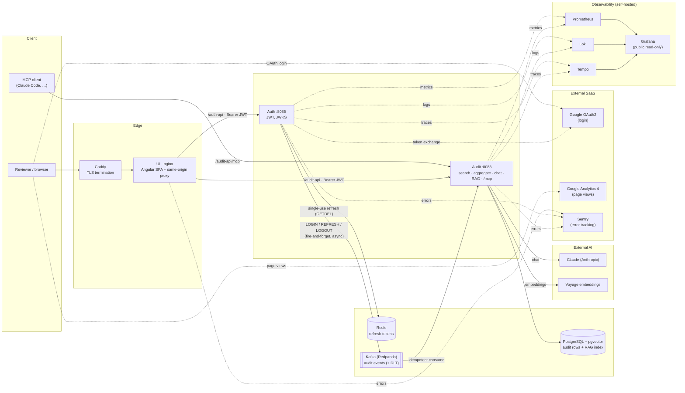

# ask-app

A production-shaped fullstack portfolio project, **live at
[ask-app.sahilparekh1212.com](https://ask-app.sahilparekh1212.com)** (demo login `demo` / `demo`): Spring Boot
microservices with Google OAuth2/JWT auth (including RBAC), an event-driven audit pipeline over
Kafka, an Angular SPA, a Claude-powered assistant grounded by RAG over this repo's own docs and
source (pgvector + Voyage embeddings), a public MCP server, a full observability stack, and CI/CD
with SAST/CVE/secret scanning, signed images, and keyless GitHub-Actions→GCP deployment. It's a
sandbox for practicing the patterns a real system needs, not a toy CRUD demo.

**Ask the app about itself.** The Chat tab answers questions about the architecture, the ADRs, and
even the deployed source code — the RAG corpus bundles the backend + UI source at build time, so the
assistant quotes the exact code that's running. The same knowledge base is a public MCP server, so
any MCP client can ask too:

```bash
claude mcp add --transport http ask-app https://ask-app.sahilparekh1212.com/audit-api/mcp
# then, inside Claude Code: "why is there no API gateway?" → grounded in ADR-0005
```

The deployment's own metrics, logs, and traces are published read-only at
[Grafana](https://ask-app.sahilparekh1212.com/grafana) (the in-app Observability dashboard is the
domain view of the same system).

**Status:** the backend, the Angular UI, and the GCP deployment are all real and current; the
[backend TODO](Backend/TODO.md) tracks what's still open honestly rather than pretending it's
further along than it is. A live off-peak k6 smoke of the read API on the shared VM measured
**p95 ≈ 97 ms with 0 errors** over public TLS — numbers and method in
[`Backend/README.md`](Backend/README.md#measured-numbers-k6-local-run-2026-07-01).

---

## Architecture



Auth issues RSA-signed JWTs and publishes a JWKS endpoint; Audit (and any future service)
verifies tokens against that endpoint without ever holding a signing secret. Auth's one piece of
state — the single-use refresh token — lives in Redis, so it scales past one replica. The two
services never call each other directly for the audit trail — Auth publishes to Kafka and moves on
whether or not the broker is up, and Audit consumes idempotently. The Audit service also hosts the
AI surface: the Claude chat proxy, the RAG index (pgvector + Voyage embeddings), and the MCP server.
Every request path enters through Caddy (TLS) → the UI's nginx, which serves the Angular SPA and
same-origin-proxies `/auth-api` and `/audit-api` to the services. Login is via Google OAuth2 (or the
zero-setup demo account); the SPA reports page views to Google Analytics 4, and the UI plus both
services report errors to Sentry. Metrics, logs, and traces flow to Prometheus / Loki / Tempo and
surface in a read-only [Grafana](https://ask-app.sahilparekh1212.com/grafana).
Full writeups of these tradeoffs (and the ones this diagram doesn't show) are in
[`Backend/docs/adr/`](Backend/docs/adr/README.md).

---

## How a chat query works

The Chat tab is grounded by RAG, but the three external pieces never talk to each other —
**Voyage** (embeddings), **pgvector** (the vector index), and **Claude** (the LLM) are independent.
The **Audit service is the sole orchestrator**: it calls each one in turn and carries the data
between them. Everything below happens inside the Audit service:

```
1.  query text                                    ──►  Voyage    ──►  query vector
2.  query vector                                  ──►  pgvector  ──►  top-5 chunk text (+ scores)
3.  chunk text + [audit data] + history + query   ──►  Claude    ──►  answer
```

1. **Embed the question.** The backend sends the query text to Voyage and gets back a vector.
   Voyage is stateless — it knows nothing about the database or Claude.
2. **Search.** The backend runs that vector as a similarity query against pgvector, which returns
   the top-5 chunks' text (source, heading, content) and their scores. Voyage never touches the
   database.
3. **Assemble the prompt.** The backend builds the prompt from the retrieved chunk _text_, plus —
   only when the question is about app state — live audit data (role-scoped), the chat history, and
   the query.
4. **Answer.** The backend sends that prompt to Claude, which writes the answer.

**Claude never sees a vector.** Vectors exist only for the search step (Voyage produces them,
pgvector compares them); once the matching chunks are found, only their human-readable text goes
into the prompt. The mental model: Voyage is a calculator (text → vector), pgvector is a search
index (vector → nearest chunks), and Claude is a writer (prompt → answer) — the Audit service is
the conductor that calls all three in order.

---

## Tech stack

Live links point at the running deployment; rows with no public surface (internal messaging/DB)
are marked —.

| Layer | Choice | Official site(s) | Live (this deployment) |
|---|---|---|---|
| Language / runtime | Java 17, Spring Boot 3.5 | [OpenJDK](https://openjdk.org) · [Spring Boot](https://spring.io/projects/spring-boot) | [Audit health](https://ask-app.sahilparekh1212.com/audit-api/actuator/health) · [Auth health](https://ask-app.sahilparekh1212.com/auth-api/actuator/health) |
| Build | Gradle, multi-module (`common` / `Audit` / `Auth`) | [Gradle](https://gradle.org) | — |
| Auth | Google OAuth2, JWT (RSA-signed), JWKS, role-based access control | [Google OAuth2](https://developers.google.com/identity/protocols/oauth2) · [JWT](https://jwt.io) | [Demo login](https://ask-app.sahilparekh1212.com/login) |
| API docs | Swagger UI / OpenAPI 3, generated from the running code by springdoc-openapi | [Swagger](https://swagger.io) · [OpenAPI](https://www.openapis.org) · [springdoc](https://springdoc.org) | [Audit Swagger](https://ask-app.sahilparekh1212.com/audit-api/swagger-ui.html) · [Auth Swagger](https://ask-app.sahilparekh1212.com/auth-api/swagger-ui/index.html) |
| Messaging | Apache Kafka (Redpanda locally) — event-driven audit trail | [Apache Kafka](https://kafka.apache.org) · [Redpanda](https://redpanda.com) | — (internal) |
| Database | PostgreSQL + pgvector (DEV/SIT/UAT/PROD), H2 (LOCAL/tests), Liquibase migrations | [PostgreSQL](https://www.postgresql.org) · [pgvector](https://github.com/pgvector/pgvector) · [H2](https://www.h2database.com) · [Liquibase](https://www.liquibase.com) | — (internal) |
| AI | Claude chat assistant (official Anthropic Java SDK, server-side key, guardrailed; live audit data grounds answers only when the question is about app state), RAG over the repo's own docs *and source* (Voyage AI embeddings, pgvector), hand-rolled MCP server (`/mcp`) | [Anthropic Claude](https://www.anthropic.com/claude) · [Voyage AI](https://www.voyageai.com) · [MCP](https://modelcontextprotocol.io) | [Chat](https://ask-app.sahilparekh1212.com/chat) · [MCP endpoint](https://ask-app.sahilparekh1212.com/audit-api/mcp) (POST) |
| Observability | Prometheus (metrics), Loki (logs), Tempo (traces), Grafana (dashboards) | [Prometheus](https://prometheus.io) · [Loki](https://grafana.com/oss/loki/) · [Tempo](https://grafana.com/oss/tempo/) · [Grafana](https://grafana.com) | [Live Grafana](https://ask-app.sahilparekh1212.com/grafana) (read-only) |
| CI | GitHub Actions — build/test/coverage, k6 load test, Playwright E2E against the full compose stack, API contract gate (openapi-diff), PIT mutation testing, CodeQL, Trivy (deps + images), Dependabot, secret scanning, conventional commits | [GitHub Actions](https://github.com/features/actions) · [k6](https://k6.io) · [Playwright](https://playwright.dev) · [PIT](https://pitest.org) · [CodeQL](https://codeql.github.com) · [Trivy](https://trivy.dev) | [Actions runs](https://github.com/sahilparekh1212/ask-app/actions) |
| CD / supply chain | Versioned images to GHCR on every merge (SemVer + git SHA + latest), cosign keyless signing, syft SBOM attestations | [GHCR](https://github.com/features/packages) · [Sigstore/cosign](https://www.sigstore.dev) · [Syft](https://github.com/anchore/syft) | [GHCR packages](https://github.com/sahilparekh1212?tab=packages) |
| Deployment | Live: GCE VM, deployed by GitHub Actions via Workload Identity Federation (keyless), Caddy TLS. Also: Docker multi-stage builds, OpenShift manifests (HPA, PVCs, routes) | [Google Cloud](https://cloud.google.com/compute) · [Caddy](https://caddyserver.com) · [Docker](https://www.docker.com) · [OpenShift](https://www.openshift.com) | [Live app](https://ask-app.sahilparekh1212.com) |
| Frontend | Angular 21 SPA (`UI/`) — standalone components + signals, nginx same-origin proxies, hand-rolled i18n runtime (currently English-only), Google Analytics 4 (GA4) + Sentry monitoring | [Angular](https://angular.dev) · [nginx](https://nginx.org) · [Google Analytics](https://marketingplatform.google.com/about/analytics/) · [Sentry](https://sentry.io) | [Live app](https://ask-app.sahilparekh1212.com) |

---

## State — what's stateless, what's stateful (and why)

The guiding rule: **the things that serve requests are stateless so they scale horizontally; the
state is deliberately pushed out to a few stateful backing services.** That's what lets Auth and
Audit run as many interchangeable replicas — any pod can serve any request because it holds
nothing between requests.

| Component | | Why |
|---|---|---|
| **UI — Angular SPA** | 🟢 Stateless | Served as static files by nginx; the browser holds only a bearer JWT (+ refresh) in `localStorage` and ephemeral in-memory signals. No server session; each API call re-presents the token. |
| **UI — nginx** | 🟢 Stateless | Serves the static bundle and same-origin-proxies `/auth-api` + `/audit-api`. No per-user state. |
| **Auth service** | 🟢 Stateless | Signs/verifies JWTs; verifiers use its JWKS. No HTTP session — its one piece of state (the single-use refresh token) is externalized to Redis, so it scales past one replica ([ADR-0007](Backend/docs/adr/0007-redis-refresh-token-store-for-statelessness.md)). |
| **Audit service** | 🟢 Stateless | Verifies JWTs locally against Auth's JWKS; no session. Its chat/RAG/MCP endpoints are stateless per request (chat history is resent by the client each turn). |
| **Rate limiter** | 🟡 Per-pod state | Deliberately *not* shared: an in-memory, thread-interrupt "newest-wins" dedup that must stay process-local — a small amount of ephemeral per-pod state, not shared session state ([ADR-0007](Backend/docs/adr/0007-redis-refresh-token-store-for-statelessness.md)). |
| **PostgreSQL + pgvector** | 🔴 Stateful | The durable system of record: audit rows, plus the `rag_chunk` vector index. On a persistent volume. |
| **Redis** | 🔴 Stateful | The single-use refresh-token store (atomic `GETDEL` + TTL), shared across Auth replicas. |
| **Kafka / Redpanda** | 🔴 Stateful | The durable `audit.events` log (+ its DLT) — an event store that persists and can replay. |
| **Prometheus** | 🔴 Stateful | Scrapes and stores metrics time-series in its own on-disk TSDB. |
| **Loki** | 🔴 Stateful | Stores aggregated logs. |
| **Tempo** | 🔴 Stateful | Stores distributed traces. |
| **Grafana** | 🟡 Config-as-code | Keeps a small internal DB (users/prefs), but datasources + dashboards are **provisioned from files** and access is anonymous read-only, so it's reproducible from config rather than a source of truth. |
| **Caddy (edge TLS)** | 🟡 Mostly stateless | Stateless request routing/TLS termination; the only durable bit is the ACME/Let's Encrypt cert cache on disk. |
| **Voyage (embeddings)** | 🟢 Stateless | External request/response — text → vector, no memory between calls. |
| **Claude / Anthropic (LLM)** | 🟢 Stateless | External request/response — each call carries its own full context; there is no server-side memory, which is exactly why the chat history is resent every turn. |

Two nuances worth calling out: the **`rag_chunk` vector index is the one *reconstructible* stateful
store** — it self-heals on restart from the corpus bundled in the image (content-hash incremental
indexing), which is why the backup script excludes it and only audit rows truly need backing up.
And **"stateless service" doesn't mean "no state anywhere"** — it means the *state lives in the
backing stores*, so the compute tier stays horizontally scalable.

---

## CI/CD checks

Every pull request runs the gates below (branch protection blocks the merge on the required ones);
every merge to `main` runs the release + deploy pipeline. All are GitHub Actions.

**Build & test**

- **Build, test & coverage** (Backend) — Spotless Java formatting, compile, JUnit + `@SpringBootTest`
  + embedded-Kafka integration tests, JaCoCo with a **90% line-coverage gate**, and **diff-cover** on
  the changed lines.
- **Lint, build & test** (Frontend) — Prettier format check, ESLint, production build (with bundle
  budgets), and headless Karma unit tests.
- **Playwright E2E (compose stack)** — boots the full docker-compose stack and drives the real path
  browser → nginx → Auth → Kafka → Audit → Postgres (nothing mocked).

**Quality & contract**

- **PIT mutation testing (report-only)** — mutation score per module, surfaced in the job summary.
- **Breaking-change gate (openapi-diff)** — regenerates both services' OpenAPI specs from the running
  code (PR head vs base branch) and fails on incompatible API changes; overridable with the
  `breaking-change-approved` label for intentional breaks.

**Security & supply chain**

- **CodeQL — Analyze (java-kotlin)** — SAST on every PR and on a schedule.
- **Trivy CVE scan** — dependency + image vulnerability scan → SARIF to the Security tab; fixable
  HIGH/CRITICAL gate the merge.
- **pre-commit (hygiene + secrets)** — gitleaks + private-key detection + repo hygiene hooks.
- **Dependabot** — automated dependency-update PRs and alerts.

**Performance & conventions**

- **Load test (k6)** — throughput (rate limiter off) and rate-limit shedding (limiter on); asserts p95
  latency and clean 429s with no 5xx.
- **Conventional commit messages** — commitlint on every commit in the PR.

**On merge to `main`**

- **CD** — matrix-builds the `auth` / `audit` / `ui` images and pushes to GHCR (generated SemVer +
  `sha-<short>` + `latest`), **cosign** keyless signing of each pushed digest, and a **syft** SBOM
  attached as a signed attestation.
- **Deploy** — keyless (Workload Identity Federation) GitHub-Actions → GCE deploy: ships the compose
  bundle, pulls the signed images, restarts the stack, and smoke-checks `/`, the health endpoints, and
  an MCP `ping` through the public origin.

---

## Run it yourself

The live deployment above needs nothing from you — this section is for running the same stack
locally:

```bash
cd Backend
docker compose up --build
```

Brings up the Angular UI (http://localhost:4200, demo login `demo`/`demo`), Postgres, Kafka,
both services, and the full observability stack. The AI features additionally need provider keys
(`ANTHROPIC_API_KEY` for chat, `VOYAGE_API_KEY` for RAG indexing) exported before
starting — without them those endpoints degrade cleanly and everything else works. Or try the
API immediately with the zero-setup demo login — no Google OAuth credentials needed:

```bash
curl -X POST http://localhost:8085/auth/login \
  -H 'Content-Type: application/json' \
  -d '{"username":"demo","password":"demo"}'
```

**No build at all** — run the exact CI-built images that CD publishes to GHCR on every merge
(public, signed, SBOM-attached):

```bash
cd Backend
docker compose -f docker-compose.yml -f docker-compose.ghcr.yml up -d --no-build
```

Full instructions (including running services individually with Gradle, connecting to the
database, verifying image signatures, and deploying to OpenShift) are in
[`Backend/README.md`](Backend/README.md).

---

## License

**Proprietary — all rights reserved.** This repository is published for viewing/portfolio
evaluation only; no right to use, run, copy, modify, or distribute the code is granted. See
[LICENSE](LICENSE).
