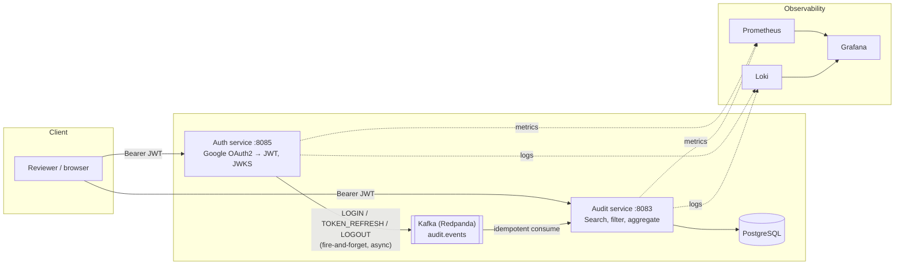

# AI-Sandbox

A production-shaped fullstack portfolio project, **live at
[ai-sandbox.sahilparekh1212.com](https://ai-sandbox.sahilparekh1212.com)**: Spring Boot
microservices with Google OAuth2/JWT auth (including RBAC), an event-driven audit pipeline over
Kafka, an Angular SPA, a Claude-powered assistant grounded by RAG over this repo's own docs and
source (pgvector + Voyage embeddings), a public MCP server, a full observability stack, and CI/CD
with SAST/CVE/secret scanning, signed images, and keyless GitHub-Actions→GCP deployment. It's a
sandbox for practicing the patterns a real system needs, not a toy CRUD demo.

## Try it live

- **App:** https://ai-sandbox.sahilparekh1212.com — sign in with the demo account
  (`demo` / `demo`, pick `ROLE_ADMIN` to try the admin-gated features). Google sign-in works too,
  but its OAuth consent screen is in testing mode, so it's limited to registered test users — the
  demo login is the intended door.
- **Ask the app about itself:** the Chat tab answers questions about the architecture, the ADRs,
  and even the deployed source code (the RAG corpus bundles the backend + UI source at build
  time, so the assistant quotes the exact code that's running).
- **Live system dashboards:** https://ai-sandbox.sahilparekh1212.com/grafana — the deployment's
  own Grafana, published read-only (metrics, logs and traces of the very services answering your
  requests; the audit dashboard in-app is the domain view of the same system).
- **Public MCP server** — point any MCP client at the deployment and search its knowledge base:

  ```bash
  claude mcp add --transport http ai-sandbox https://ai-sandbox.sahilparekh1212.com/audit-api/mcp
  # then, inside Claude Code: "why is there no API gateway?" → grounded in ADR-0005
  ```

**Status:** the backend, the Angular UI, and the GCP deployment are all real and current; the
[backend TODO](Backend/TODO.md) tracks what's still open honestly rather than pretending it's
further along than it is. A live off-peak k6 smoke of the read API on the shared VM measured
**p95 ≈ 97 ms with 0 errors** over public TLS — numbers and method in
[`Backend/README.md`](Backend/README.md#measured-numbers-k6-local-run-2026-07-01).

---

## Architecture



Auth issues RSA-signed JWTs and publishes a JWKS endpoint; Audit (and any future service)
verifies tokens against that endpoint without ever holding a signing secret. The two services
never call each other directly for the audit trail — Auth publishes to Kafka and moves on
whether or not the broker is up, and Audit consumes idempotently. The Audit service also hosts
the AI surface: the Claude chat/flashcards proxy, the RAG index, and the MCP server. In the live
deployment the browser reaches all of it through Caddy (TLS) → the UI's nginx, which
same-origin-proxies `/auth-api` and `/audit-api` to the services — the diagram shows the logical
flow. Full writeups of these tradeoffs (and the ones this diagram doesn't show) are in
[`Backend/docs/adr/`](Backend/docs/adr/README.md).

---

## Tech stack

| Layer            | Choice                                                              |
|-------------------|----------------------------------------------------------------------|
| Language / runtime | Java 17, Spring Boot 3.5                                             |
| Build             | Gradle, multi-module (`common` / `Audit` / `Auth`)                   |
| Auth              | Google OAuth2, JWT (RSA-signed), JWKS, role-based access control     |
| Messaging         | Apache Kafka (Redpanda locally) — event-driven audit trail           |
| Database          | PostgreSQL + pgvector (DEV/SIT/UAT/PROD), H2 (LOCAL/tests), Liquibase migrations |
| AI                | Claude chat assistant + flashcards (official Anthropic Java SDK, server-side key, guardrailed), RAG over the repo's own docs *and source* (Voyage AI embeddings, pgvector), hand-rolled MCP server (`/mcp`) |
| Observability     | Prometheus (metrics), Loki (logs), Tempo (traces), Grafana (dashboards) |
| CI                | GitHub Actions — build/test/coverage, k6 load test, Playwright E2E against the full compose stack, API contract gate (openapi-diff), PIT mutation testing, CodeQL, Trivy (deps + images), Dependabot, secret scanning, conventional commits |
| CD / supply chain | Versioned images to GHCR on every merge (SemVer + git SHA + latest), cosign keyless signing, syft SBOM attestations |
| Deployment        | Live: GCE VM, deployed by GitHub Actions via Workload Identity Federation (keyless), Caddy TLS. Also: Docker multi-stage builds, OpenShift manifests (HPA, PVCs, routes) |
| Frontend          | Angular 21 SPA (`UI/`) — standalone components + signals, nginx same-origin proxies, hand-rolled i18n runtime (currently English-only), GA4 analytics + Sentry monitoring |

---

## Run it yourself

The live deployment above needs nothing from you — this section is for running the same stack
locally:

```bash
cd Backend
docker compose up --build
```

Brings up the Angular UI (http://localhost:4200, demo login `demo`/`demo`), Postgres, Kafka,
both services, and the full observability stack. The AI features additionally need provider keys
(`ANTHROPIC_API_KEY` for chat/flashcards, `VOYAGE_API_KEY` for RAG indexing) exported before
starting — without them those endpoints degrade cleanly and everything else works. Or try the
API immediately with the zero-setup demo login — no Google OAuth credentials needed:

```bash
curl -X POST http://localhost:8085/auth/login \
  -H 'Content-Type: application/json' \
  -d '{"username":"demo","password":"demo"}'
```

**No build at all** — run the exact CI-built images that CD publishes to GHCR on every merge
(public, signed, SBOM-attached):

```bash
cd Backend
docker compose -f docker-compose.yml -f docker-compose.ghcr.yml up -d --no-build
```

Full instructions (including running services individually with Gradle, connecting to the
database, verifying image signatures, and deploying to OpenShift) are in
[`Backend/README.md`](Backend/README.md).

---

## Why this repo exists

Built and iterated on as a hands-on way to practice the parts of backend engineering that don't
show up in a tutorial: what happens when a request is superseded mid-flight (rate limiting with
transactional rollback), what "idempotent" actually requires at a Kafka consumer, why a JWT
signing algorithm choice matters once there's more than one verifying service, and what a CI
pipeline needs to actually gate merges rather than just report problems. The
[ADRs](Backend/docs/adr/README.md) and [TODO](Backend/TODO.md) are kept current on purpose — they're
as much a part of the portfolio as the code.

## License

[MIT](LICENSE)
