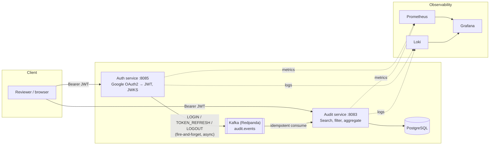

# AI-Sandbox

A portfolio project demonstrating production-shaped backend engineering: Spring Boot
microservices with Google OAuth2/JWT auth (including RBAC), an event-driven audit pipeline over
Kafka, a full observability stack, and CI with SAST/CVE/secret scanning — all deployable to
OpenShift. It's a sandbox for practicing the patterns a real backend needs, not a toy CRUD demo.

**Status:** the backend is real and hardened (see below). The Angular UI in [`UI/`](UI/) hasn't
been built yet — the [backend TODO](Backend/TODO.md) tracks it honestly rather than pretending
it's further along than it is.

---

## Architecture



Auth issues RSA-signed JWTs and publishes a JWKS endpoint; Audit (and any future service)
verifies tokens against that endpoint without ever holding a signing secret. The two services
never call each other directly for the audit trail — Auth publishes to Kafka and moves on
whether or not the broker is up, and Audit consumes idempotently. Full writeups of these
tradeoffs (and the ones this diagram doesn't show) are in
[`Backend/docs/adr/`](Backend/docs/adr/README.md).

---

## Tech stack

| Layer            | Choice                                                              |
|-------------------|----------------------------------------------------------------------|
| Language / runtime | Java 17, Spring Boot 3.4                                             |
| Build             | Gradle, multi-module (`common` / `Audit` / `Auth`)                   |
| Auth              | Google OAuth2, JWT (RSA-signed), JWKS, role-based access control     |
| Messaging         | Apache Kafka (Redpanda locally) — event-driven audit trail           |
| Database          | PostgreSQL (DEV/SIT/UAT/PROD), H2 (LOCAL/tests), Liquibase migrations |
| Observability     | Prometheus (metrics), Loki (logs), Grafana (dashboards)              |
| CI/CD             | GitHub Actions — build/test/coverage, k6 load test, CodeQL, Trivy (deps + images), Dependabot, secret scanning, conventional commits |
| Deployment        | Docker (multi-stage builds), OpenShift manifests (HPA, PVCs, routes)  |
| Frontend          | Angular (planned — see [`Backend/TODO.md`](Backend/TODO.md))          |

---

## Run it

```bash
cd Backend
docker compose up --build
```

Brings up Postgres, Kafka, both services, and the full observability stack. Try it immediately
with the zero-setup demo login — no Google OAuth credentials needed:

```bash
curl -X POST http://localhost:8085/auth/login \
  -H 'Content-Type: application/json' \
  -d '{"username":"demo","password":"demo"}'
```

Full instructions (including running services individually with Gradle, connecting to the
database, and deploying to OpenShift) are in [`Backend/README.md`](Backend/README.md).

---

## Why this repo exists

Built and iterated on as a hands-on way to practice the parts of backend engineering that don't
show up in a tutorial: what happens when a request is superseded mid-flight (rate limiting with
transactional rollback), what "idempotent" actually requires at a Kafka consumer, why a JWT
signing algorithm choice matters once there's more than one verifying service, and what a CI
pipeline needs to actually gate merges rather than just report problems. The
[ADRs](Backend/docs/adr/README.md) and [TODO](Backend/TODO.md) are kept current on purpose — they're
as much a part of the portfolio as the code.

## License

[MIT](LICENSE)
