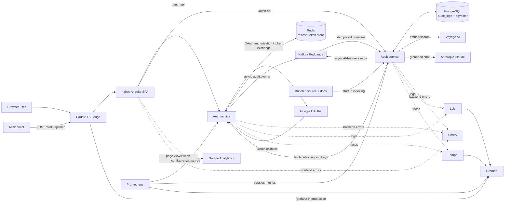

# 🗺️ System diagram

_Part of the [ask-app](../README.md) documentation._

This is the code-verified runtime architecture — how the deployed system is
connected and why its boundaries exist.

```mermaid
flowchart LR
    Browser[Browser user] --> Caddy[Caddy: TLS edge]
    MCP[MCP client] -->|POST /audit-api/mcp| Caddy
    Caddy --> UI[nginx: Angular SPA]
    Caddy -->|/grafana in production| Grafana[Grafana]

    UI -->|/auth-api| Auth[Auth service]
    UI -->|/audit-api| Audit[Audit service]

    Auth -->|OAuth authorization / token exchange| Google[Google OAuth2]
    Google -->|OAuth callback| Auth
    Audit -->|fetch public signing keys| Auth
    Auth <--> Redis[(Redis\nrefresh-token store)]
    Auth -->|async audit.events| Kafka[[Kafka / Redpanda]]
    Audit -->|async AI-feature events| Kafka
    Kafka -->|idempotent consume| Audit

    Audit <--> Postgres[(PostgreSQL\naudit_logs + pgvector)]
    Corpus[Bundled source + docs] -->|startup indexing| Audit
    Audit -->|embed/search| Voyage[Voyage AI]
    Audit -->|grounded chat| Claude[Anthropic Claude]

    UI -. page views when configured .-> GA4[Google Analytics 4]
    UI -. frontend errors .-> Sentry[Sentry]
    Auth -. backend errors .-> Sentry
    Audit -. backend errors .-> Sentry

    Prometheus[Prometheus] -->|scrapes metrics| Auth
    Prometheus -->|scrapes metrics| Audit
    Auth -. logs .-> Loki[Loki]
    Audit -. logs .-> Loki
    Auth -. traces .-> Tempo[Tempo]
    Audit -. traces .-> Tempo
    Prometheus --> Grafana
    Loki --> Grafana
    Tempo --> Grafana
```
